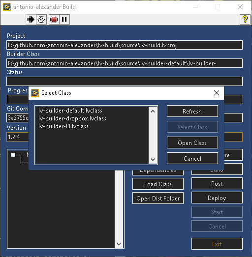

# lv-build

lv-build is a library that provides functionality to simplify and automate deployment/distribution of LabVIEW build artifacts such as instllers, zip files and libraries. It also includes one fleshed out lv-builder class (lv-builder-default) that provide the backend functionality for the "antonio-alexander build&#46;vi" interface/application (via tools > "antonio-alexander build").

## Disclaimer

This software, "lv-build" is provided by antonio-alexander "as is" and "with all faults." antonio-alexander makes no representations or warranties of any kind concerning the safety, suitability, lack of viruses, inaccuracies, typographical errors, or other harmful components of this software, "lv-build". There are inherent dangers in the use of any software, and you are solely responsible for determining whether this software, "lv-build" is compatible with your equipment and other software installed on your equipment. You are also solely responsible for the protection of your equipment and backup of your data, and antonio-alexander will not be liable for any damages you may suffer in connection with using, modifying, or distributing this software, "lv-build".

via [https://www.infoworld.com/article/2073149/software-disclaimer.html](https://www.infoworld.com/article/2073149/software-disclaimer.html)

## Use

From the perspective of using lv-build rather than implementing the backend functionality for it, you'll start the application via tools > "antonio-alexander build", you'll then select the project, then build, post and deploy as configured. Alternatively, you can use the lv-builder-default class via composition (rather than inheritance) to create your own pipeline. I personally FAILED to compile this code into an application and run it successfully.

Below shows a progression of the interface from having no project selected, to selecting a class, then a project, configuring the class and then starting the build.

## Installation/Configuration

Install using the individual vipm files or the vipc files within [dependencies](source/_dependencies).

## Dependencies

There are no dependencies for the interface "antonio-alexander build", but the lv-builder backend requires the following software dependencies:

* [7-Zip](https://www.7-zip.org/) - the binary used to compress and extract archives, either add the standalone-exe within the bin folder, or ensure that it's in the PATH environmental variable.
* [Git](https://git-scm.com/) - a tool used to interact with git-based repositories, either add the standalone-exe within the bin folder, or ensure that it's in the PATH environmental variable.
* [VI Package Manager](https://www.vipm.io/download/) - a tool used to manage labview dependencies

It will also require the following LabVIEW dependencies that can be installed from the [dependencies](source/_dependencies) folder:

* [lv-bin](https://github.com/antonio-alexander/lv-bin) - a dependency for lv-bin-git and lv-bin-7zip
* [lv-bin-git](https://github.com/antonio-alexander/lv-bin/tree/develop/source/lv-bin-git) - an api that allows lv-builder classes to interact with git
* [lv-bin-7zip](https://github.com/antonio-alexander/lv-bin/tree/develop/source/lv-bin-7zip) - an api that allows lv-builder classes to interact with 7zip
* [VIPM API](https://www.vipm.io/package/jki_lib_vipm_api/?utm_source=vipm_desktop) - an api to provide the ability to create a vipc file to store dependencies (you'll need at least the Community edition of VIPM)

Also for LabVIEW, you'll need the Application Builder if you want the build function to work (as coded).

## Classes

The packages are self-contained, and can be configured and/or set at runtime via the builder interface. The lv-builder classes interfaces provide the backend functionality.

### __lv-builder__

This is the base class which all other lv-builder classes should implement, all of the methods and accessors are implemented and won't return any errors (but obviously may not implement the expected functionality).

Below are some guidelines to show the motivations behind the class and how it was "meant" to be implemented to ease any extensions of the interfaces:

* Most of the methods use private data to store configuration rather than reading them from input terminals, as a result its much easier to use existing functionality via composition (including an existing class as private data) rather than inheritance
* Never serialize (i.e. commit) your run-time data to disk within a method that's not commit.vi
* Keep in mind that if you attempt to use inheritance, you can't "share" data between classes, but can share methods (you'll need to inject any info to the inside)

Methods:

* build.vi - use this to build one or more build specifications
* commit.vi - use this to commit any in-memory data for a given class. This is meant to provide some ability direct the serialization of runtime data.
* configure.vi - use this to configure a given class, use this to provide interactive configuration
* dependencies.vi - use this to generate dependencies for a given project
* deploy.vi - use this to deploy one or more build specifications
* initialize.vi - use this to initialize the environment for your class
* post.vi - use this to perform one or more post operations for a given build specification

Accessors:

* commit_hash (read/write) - use this to store the commit hash for the application, this can be used when updating a version (see [lv-builder-default](source/lv-builder-default))
* configuration (read/write) - use this to read or write configuration, it's provided via variant so the calling VI will need to know the type
* distribution_folder (read) - use this to store the folder where distributions (artifacts generated by the post function) are stored
* project_file (read/write) - use this to store the project file that owns the build specifications
* version (read/write) - use this to store the current version of the project

### __lv-builder-default__

lv-builder-default implements the lv-builder class to implement MY (as in personal) workflow for building artifacts and handling post operations. The items below will only cover overrided methods and accessors.

There is some quiet functionality where it can store the commit hash and version within a VI by setting the default values programatically.

A common problem is that attempts to build will fail with error 1000, stating that the VI has some problem. This can generally be solved by restarting LabVIEW, or attempting to build manually (sometimes). Haven't found a way to resolve this problem 100% of the time.

Methods:

* build.vi - this can be used to build one or more build artifacts of any type. For types of application_pc, and installer, it will attempt to update the version VI (functional global) if update_version_vi is set, and if an application or installer, it will update the version (will convert nn.nn.nn to it's major.minor.build). It will also clean before it attempts to build.
* commit.vi - this will attempt to save any runtime configuration to disk in a file named "lv-builder-default.json" in the same folder as the project file. It's contents will be indexed BY project file in the event multiple project files exist within the folder
* configure.vi - this will allow configuration of all runtime items interactively, it will launch a custom UI.
* dependencies.vi - this will use the VI Package Manager API to generate a vipc file for all static dependencies for a given project (stuff install via VIPC that's under dependencies)
* initialize.vi - uthis will initialize the package, load the current configuration and setup the paths for git and 7zip.
* post.vi - this can be used to perform one or more post operations depending on the type of build from the [get_build_specs.vi](source/lv-build/public/get_build_specs.vi):

  * lvlibp - you can "move" or "install" to the configured lvlibp folders
  * zip - you can "move" or "extract" to the configured zip folder
  * application_pc - you can "zip" the application into a file in the distribution folder
  * installer - you can "zip", "create installer" and "create an installer with file" all using 7-Zip. When I say "create installer" I mean a one-click, self-extracting installer.

Accessors:

* configuration (read/write) - use this to read or write configuration, it's provided via variant so the calling VI will need to know the type
* distribution_folder (read) - use this to store the folder where distributions (artifacts generated by the post function) are stored
* version (read/write) - use this to store the current version of the project

Utilities:

* update_version.vi - this is a VI that will load a given VI from a path and update the default values for two controls: version (string) and commit_hash (string).
* convert_version.vi - this is a VI that will attempt to convert a ##.##.## version to a three numeric cluster to set the application/installer version.